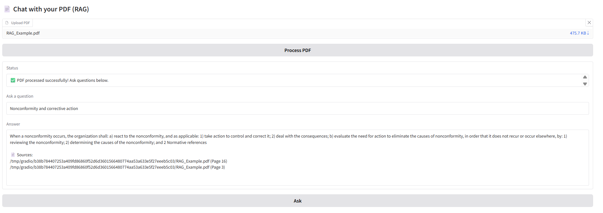

# 📄 QA Chatbot using RAG


A lightweight **Retrieval-Augmented Generation (RAG)** chatbot that allows you to upload a PDF and ask questions answered **strictly from the document’s content**.

---

## 🖼️ App Demo Screenshot


---

## ✨ Features

* **PDF Question Answering:** Upload any PDF and ask natural-language questions.
* **Grounded Answers:** The model is explicitly instructed to answer only from retrieved context.
* **Source Citations:** Displays the document source and page numbers for transparency.
* **CPU-Friendly:** Uses lightweight embedding and language models.
* **No API Keys:** Runs fully offline after model download.

---

## 🧱 Architecture Overview

```

PDF
↓
PyPDFLoader
↓
Recursive Text Splitter
↓
Embedding Model (MiniLM)
↓
Vector Store (Chroma – in-memory)
↓
Retriever (MMR)
↓
LLM (FLAN-T5)
↓
Answer + Sources

````

This follows a standard **RAG pipeline**, optimized for correctness and simplicity rather than scale.

---

## 🛠️ Tech Stack

* **UI:** Gradio
* **LLM:** `google/flan-t5-base`
* **Embeddings:** `sentence-transformers/all-MiniLM-L6-v2`
* **Vector Store:** Chroma (in-memory)
* **Framework:** LangChain
* **Backend:** PyTorch + Transformers

---

## 📦 Installation

### 1. Clone the Repository
```bash
git clone https://github.com/arman1o1/pdf-rag-chatbot.git
cd pdf-rag-chatbot
````

### 2. Install Dependencies

It is recommended to use a virtual environment.

```bash
pip install -r requirements.txt
```

---

## ▶️ Usage

Run the application locally:

```bash
python app.py
```

On first run, the models will download automatically (may take a few minutes on CPU).

Once ready, Gradio will display a local URL:

```text
Running on local URL: http://127.0.0.1:7860
```

Open the link in your browser to start chatting with your PDF.

---

## ⚙️ Technical Details

* **Retrieval Strategy:** Maximum Marginal Relevance (MMR) to reduce redundancy
* **Chunking:** PDF-friendly chunking with overlap for better factual recall
* **Chain Type:** `stuff` (simple and fast for short-to-medium PDFs)
* **Hallucination Control:** Explicit prompt instruction to say *“I don’t know”* when context is insufficient
* **State Management:** Per-session `gr.State` for user isolation

---

## 🧪 Limitations

* Best suited for **short to medium-length PDFs**
* Not optimized for large document collections
* CPU inference is slower than GPU-backed systems

---

## 📄 License

The code in this repository is licensed under the **MIT License**.

Model licenses:

* `google/flan-t5-base` – Apache 2.0
* `all-MiniLM-L6-v2` – Apache 2.0

```
```
