# 📚 PDF RAG Chatbot – Complete Code Explanation

This document provides a detailed, educational walkthrough of `app.py`, a **Retrieval-Augmented Generation (RAG)** chatbot that allows users to upload PDF documents and ask questions about their content.

---

## 🏗️ Architecture Overview

```mermaid
flowchart LR
    A[📄 Upload PDF] --> B[Load & Split Text]
    B --> C[Generate Embeddings]
    C --> D[(Vector Database)]
    E[❓ User Question] --> F[Retrieve Relevant Chunks]
    D --> F
    F --> G[🤖 LLM Generates Answer]
    G --> H[📝 Display Answer + Sources]
```



The application follows the classic RAG pipeline:
1. **Ingestion**: Load PDF → Split into chunks → Convert to embeddings → Store in vector database
2. **Retrieval**: User asks question → Find most relevant chunks from the database
3. **Generation**: Feed context + question to LLM → Generate grounded answer

---

## 📦 Imports Breakdown

```python
import gradio as gr
from transformers import AutoTokenizer, AutoModelForSeq2SeqLM, pipeline
```

| Library | Purpose |
|---------|---------|
| **Gradio** | Creates the web-based user interface for uploading PDFs and asking questions |
| **Transformers** | Provides the language model (FLAN-T5) for generating answers |

```python
from langchain_community.llms import HuggingFacePipeline
from langchain_community.embeddings import HuggingFaceEmbeddings
from langchain_community.vectorstores import Chroma
from langchain_community.document_loaders import PyPDFLoader
```

| LangChain Component | Purpose |
|---------------------|---------|
| **HuggingFacePipeline** | Wraps the Hugging Face model for use with LangChain chains |
| **HuggingFaceEmbeddings** | Converts text into numerical vectors (embeddings) |
| **Chroma** | In-memory vector database for storing and retrieving document embeddings |
| **PyPDFLoader** | Extracts text content from PDF files |

```python
try:
    from langchain_text_splitters import RecursiveCharacterTextSplitter
except ImportError:
    from langchain.text_splitter import RecursiveCharacterTextSplitter
```

> **💡 Compatibility Note**: This try-except block ensures the code works with both older and newer versions of LangChain, where the module location changed.

---

## 🤖 Global LLM Initialization

```python
MODEL_NAME = "google/flan-t5-base"

tokenizer = AutoTokenizer.from_pretrained(MODEL_NAME)
model = AutoModelForSeq2SeqLM.from_pretrained(MODEL_NAME)
```

### What is FLAN-T5?

**FLAN-T5** (Fine-tuned Language Net T5) is an instruction-tuned version of Google's T5 model. Key characteristics:

| Feature | Description |
|---------|-------------|
| **Architecture** | Encoder-Decoder (Seq2Seq) – ideal for question-answering tasks |
| **Size** | `flan-t5-base` has ~250M parameters – balances quality and speed |
| **Training** | Fine-tuned on 1,800+ tasks with instructions, making it excellent at following prompts |

### Creating the Pipeline

```python
hf_pipe = pipeline(
    "text2text-generation",
    model=model,
    tokenizer=tokenizer,
    max_new_tokens=256,
    do_sample=False,
    temperature=0.0
)
```

| Parameter | Value | Explanation |
|-----------|-------|-------------|
| `task` | `"text2text-generation"` | Takes text input, produces text output |
| `max_new_tokens` | `256` | Limits response length to 256 tokens |
| `do_sample` | `False` | Disables random sampling for deterministic outputs |
| `temperature` | `0.0` | Maximum determinism – always picks the most likely token |

> **🎯 Why deterministic?** For RAG applications, we want consistent, factual answers based on the retrieved context, not creative/varied responses.

```python
LLM = HuggingFacePipeline(pipeline=hf_pipe)
```

This wraps the pipeline so it can be used seamlessly with LangChain's chain abstractions.

---

## 📄 Building the RAG Pipeline

The `build_qa_from_pdf()` function orchestrates the entire document ingestion and QA chain setup.

### Step 1: Load the PDF

```python
loader = PyPDFLoader(file.name)
documents = loader.load()
```

- **PyPDFLoader** reads the PDF and extracts text page by page
- Each page becomes a `Document` object with `page_content` and `metadata` (including page number)

### Step 2: Split Text into Chunks

```python
splitter = RecursiveCharacterTextSplitter(
    chunk_size=800,
    chunk_overlap=50
)
chunks = splitter.split_documents(documents)
```

**Why split documents?**
- LLMs have context length limits
- Smaller chunks improve retrieval precision
- Enables finding specific information rather than entire pages

| Parameter | Value | Purpose |
|-----------|-------|---------|
| `chunk_size` | `800` | Maximum characters per chunk |
| `chunk_overlap` | `50` | Characters shared between adjacent chunks (preserves context at boundaries) |

**RecursiveCharacterTextSplitter** intelligently splits by trying these separators in order:
1. `\n\n` (paragraph breaks)
2. `\n` (line breaks)
3. ` ` (spaces)
4. `` (individual characters)

This preserves semantic meaning better than fixed-size splitting.

### Step 3: Generate Embeddings

```python
embeddings = HuggingFaceEmbeddings(
    model_name="sentence-transformers/all-MiniLM-L6-v2",
    model_kwargs={"device": "cpu"}
)
```

**What are embeddings?**

Embeddings are dense numerical vectors that capture semantic meaning. Similar concepts have similar vectors.

```
"What is machine learning?" → [0.23, -0.45, 0.12, ...]
"Explain ML to me"          → [0.21, -0.44, 0.14, ...]  ← Similar!
"The weather is nice"       → [-0.82, 0.33, -0.56, ...] ← Different!
```

**all-MiniLM-L6-v2** is a compact, fast embedding model:
- 384-dimensional vectors
- Trained on 1B+ sentence pairs
- Great balance of speed and quality

### Step 4: Create Vector Database

```python
vectordb = Chroma.from_documents(
    documents=chunks,
    embedding=embeddings
)
```

**Chroma** stores the chunks and their embeddings:
1. Each chunk is converted to an embedding vector
2. Vectors are indexed for fast similarity search
3. When querying, the most similar vectors are retrieved

> **📝 Note**: This creates an **in-memory** database (no `persist_directory`), suitable for Hugging Face Spaces where file persistence isn't allowed.

### Step 5: Configure Retriever

```python
retriever = vectordb.as_retriever(
    search_type="mmr",
    search_kwargs={"k": 3, "lambda_mult": 0.7}
)
```

| Parameter | Value | Meaning |
|-----------|-------|---------|
| `search_type` | `"mmr"` | **Maximal Marginal Relevance** – balances relevance with diversity |
| `k` | `3` | Return top 3 most relevant chunks |
| `lambda_mult` | `0.7` | 70% relevance, 30% diversity weighting |

**Why MMR instead of simple similarity?**

Simple similarity might return 3 chunks that all say the same thing. MMR ensures diverse results by penalizing redundancy, giving the LLM more useful context.

### Step 6: Define the Prompt Template

```python
prompt = PromptTemplate(
    input_variables=["context", "question"],
    template="""
Answer the question using ONLY the context below.
If the answer cannot be found in the context, say "I don't know."

Context:
{context}

Question:
{question}

Answer:
"""
)
```

**Why this prompt structure?**

1. **"ONLY the context"** – Prevents hallucination by grounding answers in retrieved text
2. **"I don't know"** – Teaches the model to admit uncertainty rather than fabricate
3. **Clear sections** – Separates context, question, and answer for the model

This is called **prompt engineering** – carefully crafting instructions to get desired LLM behavior.

### Step 7: Build the QA Chain

```python
qa_chain = RetrievalQA.from_chain_type(
    llm=LLM,
    chain_type="stuff",
    retriever=retriever,
    return_source_documents=True,
    chain_type_kwargs={"prompt": prompt}
)
```

| Parameter | Value | Purpose |
|-----------|-------|---------|
| `chain_type` | `"stuff"` | Stuffs all retrieved chunks into one prompt |
| `return_source_documents` | `True` | Returns the chunks used, enabling source citations |

**Chain Types Comparison:**

| Type | How it Works | Best For |
|------|--------------|----------|
| `stuff` | All chunks in one prompt | Small documents, fast |
| `map_reduce` | Process chunks separately, then combine | Large documents |
| `refine` | Iteratively refine answer across chunks | Complex questions |

---

## ❓ Question Answering Function

```python
def ask_question(question, qa_chain):
    if qa_chain is None:
        return "⚠️ Upload and process a PDF first."

    if not question or len(question.strip()) < 5:
        return "Ask a more specific question."
```

**Input validation** ensures:
- A PDF has been processed before asking questions
- Questions are at least 5 characters (prevents empty/trivial queries)

```python
result = qa_chain.invoke({"query": question})
answer = result["result"]
```

The chain:
1. Converts question to embedding
2. Retrieves top-k similar chunks from Chroma
3. Formats prompt with context + question
4. Sends to FLAN-T5 for answer generation

### Source Attribution

```python
sources = sorted({
    f"{doc.metadata.get('source', 'Unknown')} "
    f"(Page {doc.metadata.get('page', 0) + 1})"
    for doc in result["source_documents"]
})
```

This creates de-duplicated, sorted source citations like:
```
📄 Sources:
document.pdf (Page 3)
document.pdf (Page 7)
```

> **💡 Note**: `page + 1` because PDF pages are 0-indexed internally but humans expect 1-indexed.

---

## 🖥️ Gradio User Interface

```python
with gr.Blocks(title="📄 PDF RAG Chatbot") as demo:
    gr.Markdown("## 📄 Chat with your PDF (RAG)")
```

**Gradio Blocks** provides a flexible, component-based UI framework.

### State Management

```python
qa_state = gr.State(None)
```

`gr.State` preserves the QA chain between interactions. Without this, the chain would be lost after each button click.

### UI Components

```python
pdf_file = gr.File(label="Upload PDF", file_types=[".pdf"])
process_btn = gr.Button("Process PDF")
status = gr.Textbox(label="Status", interactive=False)

question = gr.Textbox(label="Ask a question")
answer = gr.Textbox(label="Answer", lines=8)
```

| Component | Purpose |
|-----------|---------|
| `gr.File` | File upload restricted to PDFs |
| `gr.Button` | Triggers PDF processing |
| `gr.Textbox` (status) | Shows processing status (read-only) |
| `gr.Textbox` (question) | User input for questions |
| `gr.Textbox` (answer) | Displays LLM response |

### Event Handlers

```python
process_btn.click(
    build_qa_from_pdf,
    inputs=pdf_file,
    outputs=[qa_state, status]
)
```

When "Process PDF" is clicked:
- Input: The uploaded file
- Output: Updates the state (`qa_state`) and status message

```python
question.submit(
    ask_question,
    inputs=[question, qa_state],
    outputs=answer
)
```

When Enter is pressed in the question box:
- Input: The question text and current QA chain state
- Output: The answer textbox

```python
gr.Button("Ask").click(
    ask_question,
    inputs=[question, qa_state],
    outputs=answer
)
```

Alternative "Ask" button for users who prefer clicking to pressing Enter.

---

## 🔑 Key Design Decisions

| Decision | Rationale |
|----------|-----------|
| **FLAN-T5-base** | Good quality, runs on CPU, fits in free Spaces memory |
| **In-memory Chroma** | No persistence needed; fresh start per session is acceptable |
| **MMR retrieval** | Diverse context improves answer quality |
| **Strict grounding prompt** | Prevents hallucination – critical for document QA |
| **CPU-only embeddings** | Ensures compatibility with Hugging Face Spaces free tier |
| **Global LLM loading** | Load once at startup, not per-request (performance) |

---

## 🚀 Running the Application

```bash
# Install dependencies
pip install -r requirements.txt

# Run the app
python app.py
```

The app will launch at `http://localhost:7860` (Gradio's default port).

---

## 📊 Summary

This application demonstrates a complete **production-ready RAG pipeline**:

1. **Document Processing**: PDF → Chunks → Embeddings → Vector Store
2. **Intelligent Retrieval**: MMR-based search for relevant, diverse context
3. **Grounded Generation**: Prompt engineering prevents hallucination
4. **User-Friendly Interface**: Gradio provides accessible web UI
5. **Source Attribution**: Answers include page references for verification

The code prioritizes:
- ✅ **Accuracy** (grounded prompts, source citations)
- ✅ **Efficiency** (small models, lazy loading)
- ✅ **Compatibility** (CPU-friendly, cross-version imports)
- ✅ **Usability** (clear status messages, intuitive UI)
